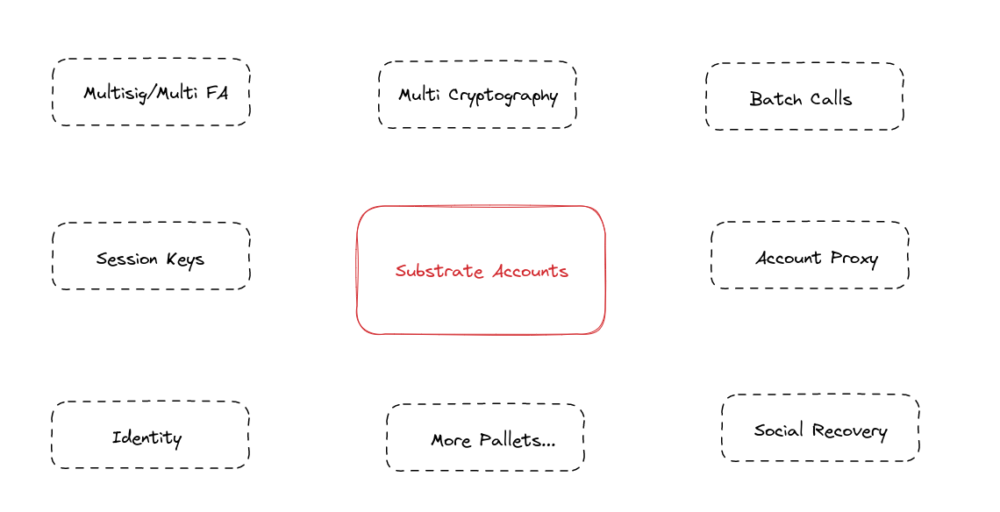

We know that one of the most important recent hot topics in the Ethereum ecosystem is the official launch of ERC-4337, which is essentially a fix for the historical legacy of the Ethereum account system design, so how exactly should a strong account system be designed? I think Substrate gives a very good answer.

## Intro

First, Substrate uses a shared set of key generation algorithms. This means that multiple addresses can be generated using the same key, each with a different prefix, to serve different parachains and applications. This approach simplifies operations for users and improves security, as users do not need to transfer assets between different chains.

## MultiSig

Multi-signature is an optional transaction validation mechanism that can use multiple signatures to verify transactions to enhance the security and reliability of the transactions. we can flexibly configure the number of multi-signers in Substrate, and we can also manage the entry and exit of multi-signer members in conjunction with Proxy. More details are below:

[MultiSig Pallet](https://personal-page-virid-three.vercel.app/docs/substrate-deep-dives/multisig)

Currently, we have `Polkadot.js`, `Subscan`, `Multix`, etc. to set multiple signatures, and we expect a phenomenal product like Gnosis Safe to appear in Substrate.

## Account Proxy

Proxy accounts allow the use of one account to control a master account, and a master account can set up multiple proxy accounts, assigning different permissions, and also supporting the iterative calls of proxy accounts. Proxy accounts provide a more flexible and secure way to manage accounts, giving users more freedom to control their property and interests. More details are below:

[Proxy Pallet](https://personal-page-virid-three.vercel.app/docs/substrate-deep-dives/proxy)

Proxy accounts can be used to perform a number of complex functions

- Complete auto-compound
- Enables flexible joining and exiting of multiple signatures
- Set up delayed proxy calls for security

## Session Keys

We can also set a session key to free users from endless password entry, and we know that the more times we enter a password, the more insecure our account becomes. We can freely configure the duration and range of the Session Key in Substrate. More details are below:

%[https://0xwhisker.hashnode.dev/how-to-make-our-wallets-more-user-friendly]

## Social Recovery

Social Recovery is not the usual login via a Google account, it is a solution that even if you lose ownership of your account, you can still recover it by some methods. In Substrate, we have designed a flexible and secure social recovery solution. More details are below:

%[https://0xwhisker.hashnode.dev/social-recovery-in-substrate]

## MultiCalls / Batch calls

There is native support for batch calls in Substrate, but there is a limit to the type of transactions that can be batch called, and they need to be **stateless**. More details are below:

%[https://0xwhisker.hashnode.dev/batch-calls-in-substrate]

## Identity

There also exists a native account identity, similar to the existence of ENS, where you do not need to buy, but only reserve, and of course support the binding of ENS, embracing different ecologies.

## Cryptography Compatibility

If we can abstract the support of cryptography primitives, we will be able to support unlimited cryptography algorithms, but at the same time we need to pay attention to the fact that this may also bring huge security risks to the system.

## Paymaster

All parachains ecosystems support native tokens as transaction gas to submit transactions, unlike Ethereum's multiple tokens, which require ETH to be paid to complete transactions. This is why Ethereum Ecosystem needs Paymaster, the high transaction fee of ETH L1 makes them want to have a Paymaster role to help them complete the transaction, and Paymaster can support different tokens to submit transactions as transaction fees, which can reduce the invisible cost of onboarding.

But in Substrate, in order to prove the validity of the account, we need to store more than 1 DOT in the account, all accounts below this balance will no longer exist in the state of the blockchain, but the ownership of the account is still yours, as long as you re-store more than 1 DOT in the account, the account will be activated, so the transaction fee will not be a problem for the transaction.

At present, the transaction gas of each parallel chain including DOT/KSM itself is lower than the L2 fee of Ethereum.

Of course, we can also submit signed payloads through the following tools, and if we need a role similar to Paymaster:

%[https://wiki.polkadot.network/docs/build-transaction-construction#submitting-a-signed-payload]

## More Pallets

We know that Substrate's design is highly modular, and the plug-in design helps us to implement native features by constantly adding Pallets, which also leaves room for us to build a more robust account system with upgrades.
