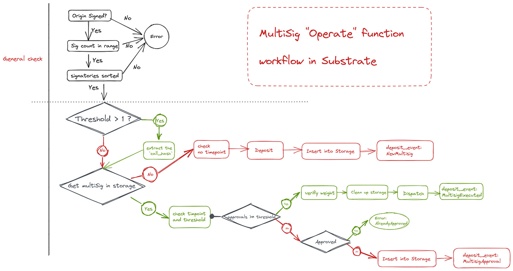

# MultiSig Pallet

## The basic concept of MultiSig

We know that in the blockchain, the perception is that a private key corresponds to the ownership of an account, as the classic saying goes:

> **Not your keys, not your coins.**

As blockchain technology evolves, the need for more secure and decentralized wallets is becoming increasingly important. multisig wallets offer a solution to this problem. In a multisig wallet, a threshold and a set of signers are established to approve transactions. This method of approval increases the security and decentralization of the wallet. Typically, the threshold is set to require more than half of the signers to approve a transaction, making the process more democratic. By using a multisig wallet, users can ensure that their assets are safe and secure, and they can have confidence that a trusted group is approving their transactions of individuals.

## MultiSig design and implementation in Substrate

If we want to implement a multisig function, we first need to have two key parameters, the **signer** (**signatories** in Substrate) and the **threshold**, which are the most basic parameters required for a multisig. We also need to maintain the multisig with a number of other parameters, including

* `when`, the block number as the point at which the multisig operation was opened.

* `deposit`, which is the amount of money reserved by the **depositor** to start the multisig operation and will be refunded when the multisig is completed

  * The design of the reserve amount will be similar to that of the transaction fee: **TotalFee = DepositBase + DepositFactor \* Threshold**

    * where `DepositBase` is the base reserve amount that must be held for a multisig to be completed, this is held for an additional storage item whose value size is `` `4 + sizeof((BlockNumber, Balance, AccountId))` `` bytes and whose key size is \``32 + sizeof(AccountId)`\` bytes.

    * `DepositFactor` is an additional cost set according to the **Threshold** number, This is held for adding 32 bytes more into a pre-existing storage value.

* `depositor`, the person who opens the multisig operation, generally the first person to approve

* `approvals`, a record of users who have currently been approved, it is important to note that since multisig is deterministic, the set of accounts here will need to be ordered

### Event design

Thus, a fully functional multi-signature solution is designed, in which we need to build in some events to complete the `deposit_event`, including

* `NewMultisig`, to create a new multisig operation

* `MultisigApproval`, someone has agreed to the multisig operation

* \`MultisigExecuted\`, the multisig operation has been executed

* \`MultisigCancelled\`, the multisig operation has been canceled

### General checks

In general, when we make multisig function calls, there are a number of generic checks that are performed to ensure state certainty, including

* the `origin` must complete the signature

* `other_signatories` is not empty and does not exceed the upper limit

* the `other_signatories` are ordered (for deterministic) and the caller is inserted afterward

* `timepoint` is not set incorrectly

### Pallet Implementation

We need to use the above design to complete a pallet implementation. The current multisig pallet includes four main functions

* **The** `as_multi_threshold_1` **function**

  * When dispatching a multisig call, we don't normally use this function because a Threshold of 1 doesn't mean much for multisig

  * requires a series of generic checks

  * Derive multisig `account_id` by `blake2_256`

* **The** `as_multi` **function**

  * Unless it is the last approval, the `approve_as_multi` function is generally used because it only takes the hash of the call

  * The parameter `maybe_timepoint`, unless it is the first approval, must be filled with none and the others must be filled with a value

  * After dispatch, a **MultisigExecuted** event will be deposit

* **The** `approve_as_multi` **function**

  * If it is the last approval, we will use the `as_multi`

* `The cancel_as_multi function`

  * Cancels an existing multisig transaction

  * If successful, the reserved funds will be returned

Of course, we have abstracted some of the operations performed and come up with an `operate` function

* The `operate` function

  * does a series of generic checks

  * We will determine if this is the first call of the multisig transaction

    * If it is

      * we need to ensure that the timepoint is empty

      * Then we do the deposit of the deposit

        * `Deposit = depositBase + threshold * depositFactor`

      * and record it in the storage

    * If not

      * Determine if the threshold is sufficient and if it is reached

        * We need to clean up this content in the storage when performing a multisig call to avoid replay attacks

        * unreserve the previous deposit

## Current problem

We can currently build a multi-signature with Polkadot.js, but its poor UX makes the whole process seem very unfriendly, with the following problems

* duplication of `callData`, there are a lot of interaction offchains that need to be avoided

* Everyone needs to do the creation of multisig signatories

* the exit of multiple signatures, changes in signatories or thresholds can lead to changes in addresses

As multisig are deterministic events, there is a requirement for signatories to be deterministic, once a participant changes, the multisig will no longer be valid. In Substrate we support **proxy accounts**, so we can use the pure proxy feature to set up a proxy account for all signatories, thus creating a multisig of proxy accounts, so that we can change the multisig at will.
