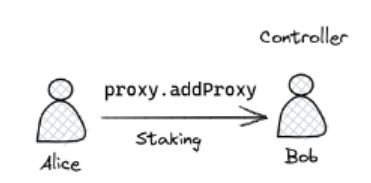
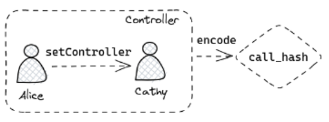
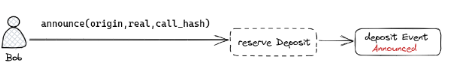
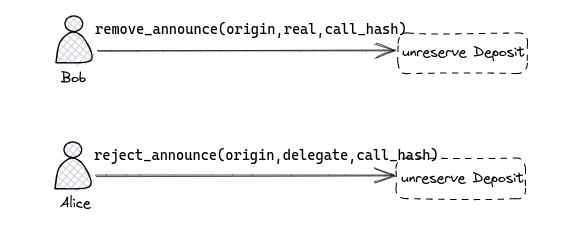
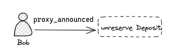

We all know that Substrate's account is a powerful design, and most users are not tech-hardcore, so they will always complain that Polkadot.js is a wallet with a flawed UI/UX, a complaint we also see with MetaMask on Ethereum, but it doesn't affect its monopoly. Of course, there are some great wallets in the DOT ecosystem, such as [**Talisman**](https://www.talisman.xyz/) and [**Subwallet**](https://subwallet.app/), that focus on improving the UI/UX of their wallets, supporting features such as **multi-chains assets portfolio**, **stake**, and **NFT view**, but they also drop many of the features supported by Polkadot.js for the sake of a better UI/UX. Now let's introduce a proxy feature that improves the security of accounts in the Substrate chain.

## Introduction to Proxy Accounts

The purpose of a proxy account is to reduce the risk of the main account by splitting the functionalities of the account. For example, a full Substrate account has the ability to transfer assets, participate in governance, stake and participate in auctions, etc. We know that the more on-chain activities a user participates in, the more they enter their password, and the more applications they authorize, the more risk they put their account at. That is why we have cold wallets like Ledger, to reduce the on-chain exposure of the account. So if we could split the functionality of our accounts and create a hierarchical system of personal accounts, would that make our accounts even more secure?

```rust
pub struct ProxyDefinition<AccountId, ProxyType, BlockNumber> {
    /// The account which may act on behalf of another.
    pub delegate: AccountId,

    /// A value defining the subset of calls that it is allowed to make.
    pub proxy_type: ProxyType,

    /// The number of blocks that an announcement must be in place for before the corresponding
    /// call may be dispatched. If zero, then no announcement is needed.
    pub delay: BlockNumber,
}
```

We can see that we have designed a structure like this in our account called `ProxyDefinition`, which contains

* `delegate`, which specifies the address of the proxy account

* `proxy_type`, the type of proxy

  * Currently the proxy account has the following permissions

    * **Any**

      * an account with full pallet access rights

    * **Non-transfer**

      * Allows any type of transaction except balance transfers (including allocation transfers)

      * No access to call on balances and XCM pallet

      * This would be the highest privileged hot wallet proxy we recommend for daily use and could also be the highest level of our nested proxies.

    * **Governance**

      * Includes access to governance related pallets such as Democracy

    * **Staking**

      * Access to the Staking, Session, Utility and FastUnstake pallets

    * **Identity Judgement**

    * **Cancel**

      * Access to `reject_announcement` calls from the Proxy pallet only

    * **Auction**

  * For the range of pallets that can be called from all proxy types, we can look at the source code [here](https://github.com/paritytech/polkadot/blob/master/runtime/polkadot/src/lib.rs#L966).

* `delay`, sets the delay at which the proxy dispatches, we can set how many blocks before the proxy starts calling.

## Basic functions of a proxy

Since a proxy is an operation that consumes space on the chain, it is inevitable that we need to make a deposit to create it, and we need to pay the appropriate fee to secure the proxy:

`Proxy_fee` = `ProxyDepositBase` + `ProxyDepositFactor` \* `n`

where `ProxyDepositBase` is a constant and `ProxyDepositFactor` is the fee to be paid for the storage consumption caused by each proxy of the account registering on the chain, which is also a state leasing idea.

The basic function of the Proxy Pallet is

* `proxy`

  * Executes the call received by the authorized account

* `add_proxy`

  * Set up a proxy account for the sender of the function, we need to specify the address of the delegator and delegatee as well as the type of proxy and the delay time, which is ultimately responsible for the operation of the reserve

* `remove_proxy` and `remove_proxies`

  * If there is a function to create a proxy, there must be a function to remove it

  * The first one specifies the delegate, the proxy type, and the delay, while the second one removes all proxy accounts associated with the primary account

  * We need to be clear that both `add_proxy` and `remove_proxy` / `remove_proxies` are essentially maintaining a key-value map for the account in storage, with the corresponding reserve and unreserve behaviors.

It is worth noting that since we will insert the proxies in order to the storage, we can use a binary search for optimization when we search the proxy like this.

```rust
let i = proxies.binary_search(&proxy_def).err().ok_or(Error::<T>::Duplicate)?;
```

## Pure Proxy

A brief introduction to the pure proxy.

* Pure proxies do not have a private key, so even if any proxy changes, you can still find out who generated the pure proxy by using the block browser to go backwards.

* Pure proxies have no way of signing anything but can be invoked via proxy calls

For the functional implementation of a pure proxy, we only need two main functions:

* `create_pure` and `kill_pure`

  * i.e. the creation and deletion of pure proxies

  * We both need to generate a pure proxy address based on the originator `origin`, the proxy type `proxy_type`, the index `index` of the same transaction and the valid time point `when`.

    * Generally speaking, a pure proxy is generated immediately, i.e. `when` is None at the time of the creation

  * Instead, our key-value map in the storage of the pure proxy address combined with `proxy_def` and the reserve amount

    * The `proxy_def` parameter is a combination of the originator `origin`, the proxy type `proxy_type` and `delay` ( the announcement period required of the initial proxy )

  * Deleting a pure proxy is even easier, just delete the relevant key-value map from the storage and unreserve it.

* An internal `pure_account` function is maintained to construct the address of the pure proxy, noting that the address of the pure proxy is constructed from `caller`, `proxy_type`, `index`, `block_height`, `extrinsics_index`.

## Time-delayed proxies

Sometimes we choose to finish the call after a certain time in order to guarantee the security of the proxy call, but we need to announce this beforehand, and this is what a delayed proxy is all about.

The implementation is also very simple:

* `announce`, `remove_announcement` and `reject_announcement`.

  * The purpose of announce is to add security to the proxy by adding an execution delay

  * `announce` will publish a hash of future proxy calls that will be executed

    * We will perform an existence check on both proxies before execution, to ensure that there is a proxy relationship between them

    * We also need to make the relevant reserve

  * `remove_announcement` removes the specified announcement, which is normally done by the delegate

  * `reject_announcement` is used to remove a delegate's specified announcement, which is normally done by the proxied account

  * The deletion is done with the help of an `edit_announcements` function to adjust the reserve amount

* `proxy_announced` is used to perform the proxy execution with the help of announce

Let's assume a scenario where Alice is the main account and she first adds a proxy account Bob, we give Bob staking access to become Alice's controller and if we need to change the controller to Cathy, we can do so:



* We first construct a `call_hash` of our actions, and we construct whatever transactions we need to make the proxy account do, for example, if we want Alice to set Cathy as her controller for Stake, we can do this in Polkadot.js by copying its `encoded call hash`

    

* Then we construct an `announce` transaction, where the `real` parameter is the delegate of the transaction, in this case, Alice, and the person constructing the transaction is Bob, the subject of the `origin` parameter in our `announce` function, and finally we fill in the copied `call_hash`, sign it and send it

    

* If we need to delete the announcement, we can do so in two ways, either by calling `remove_announce` from the proxy account Bob, or by calling `reject_announce` from the main account Alice

    

* After we have waited the delay time, we can finally finish the execution with `proxy_announced`

    

## Proxy Calls

Proxy calls are supported in Substrate, i.e. we can initiate a call to another proxy through a proxy account, thus forming a proxy iteration.

* It is important to note that a proxy call cannot exceed the permissions it has

* It is also not possible to delete all proxies or pure proxies unless the proxy caller has full access.

## Current Problem

* The `call_hash` in the create announce and delete announce operations need to be constructed manually by the user

* After constructing the announcement, when we execute `proxy_announced` we need to fill in the appropriate parameters again as we did when constructing the announce

* The deletion of a pure proxy requires the `block_height` and `extrinsics_index` parameters from the pure proxy construction, which also need to be filled in manually

Of course, this problem can be solved by secondary development based on the Proxy Pallet, and we are looking forward to good UI/UX wallet integrations such as Talisman and Subwallet for these features, I think the Substrate account is far from reaching its full potential at the moment, so look forward to the rest of the story!
