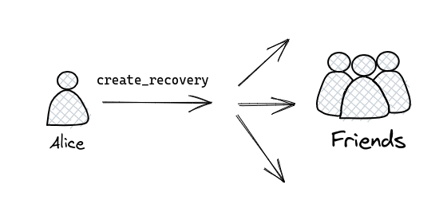
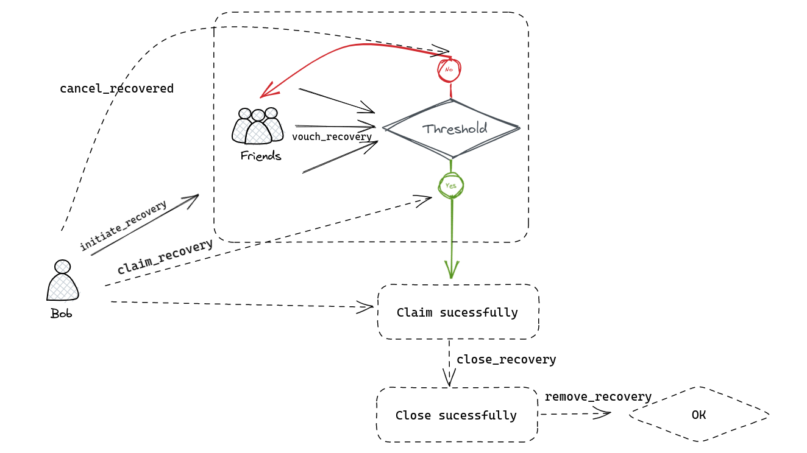

One of the biggest challenges for ordinary users regarding cryptocurrency and blockchain applications is undoubtedly security. Due to the unique mapping between accounts and private keys, ensuring the security of our assets requires us to ensure the security of our private keys. There are various methods we can use to enhance the UX in this area, including multi-signature, and account proxy, and today, we will introduce another way - social recovery.

The significance of social recovery lies in further weakening the uniqueness of private keys. If we can regain ownership of an account through some means while losing the private key, we will be able to improve the UX of the wallet to a level similar to that of real-world bank cards. This will have significant implications for onboarding in crypto.

## Social recovery Pallet

If the private key or other authentication mechanism is lost, users can use this pallet to call on their already recovered account. The recovery process is protected by trusted "friends" selected by the original account owner. An access threshold (M) of one of N friends is required to allow another account to access the recoverable account.

Here's an example to see how the recover pallet works, its lifecycle, and its code implementation

### Create Recovery



If you want to enable social recovery on your account, you need to specify the relevant configuration in the chain, which we do by calling the `create_recovery` function in the specific implementation. Let's take the example of Alice, who has configured her account for social recovery.

```rust
pub fn create_recovery(
    origin: OriginFor<T>,
    friends: Vec<T::AccountId>,
    threshold: u16,
    delay_period: T::BlockNumber,
) -> DispatchResult {
    let who = ensure_signed(origin)?;
    // Check account is not already set up for recovery
    ensure!(!<Recoverable<T>>::contains_key(&who), Error::<T>::AlreadyRecoverable);
    // Check user input is valid
    ensure!(threshold >= 1, Error::<T>::ZeroThreshold);
    ensure!(!friends.is_empty(), Error::<T>::NotEnoughFriends);
    ensure!(threshold as usize <= friends.len(), Error::<T>::NotEnoughFriends);
    let bounded_friends: FriendsOf<T> =
        friends.try_into().map_err(|_| Error::<T>::MaxFriends)?;
    ensure!(Self::is_sorted_and_unique(&bounded_friends), Error::<T>::NotSorted);
    // Total deposit is base fee + number of friends * factor fee
    let friend_deposit = T::FriendDepositFactor::get()
        .checked_mul(&bounded_friends.len().saturated_into())
        .ok_or(ArithmeticError::Overflow)?;
    let total_deposit = T::ConfigDepositBase::get()
        .checked_add(&friend_deposit)
        .ok_or(ArithmeticError::Overflow)?;
    // Reserve the deposit
    T::Currency::reserve(&who, total_deposit)?;
    // Create the recovery configuration
    let recovery_config = RecoveryConfig {
        delay_period,
        deposit: total_deposit,
        friends: bounded_friends,
        threshold,
    };
    // Create the recovery configuration storage item
    <Recoverable<T>>::insert(&who, recovery_config);

    Self::deposit_event(Event::<T>::RecoveryCreated { account: who });
    Ok(())
}
```

Let's take a deeper look at the meaning and role of each parameter in the function.

* The role of `origin` is to specify the address of the account for which the recovery function is configured and to verify that the transaction is signed by that account. Only this account can enable or disable recovery.

* The `friends` parameter is a list of accounts that can participate in the social recovery. These friend accounts must be specified in advance and cannot be changed during runtime. If the `friends` list is to be changed, recovery needs to be disabled and re-enabled.

* The `threshold` is the threshold required to set social recovery. The minimum number of friends that need to agree to a successful recovery operation during social recovery.

* `delay_period` indicates the block delay time to wait after the threshold has been reached. During social recovery, implementers may deliberately cancel the recovery operation before the threshold is met. To prevent this, a delay period is set and if the recovery operation is not canceled within the delay period, the recovery operation is initiated.

In the implementation of the function we see:

* A series of validity checks:

  * Checking whether `origin` is a valid account signature

  * check that the account is already supported for social recovery

  * check that the user's set of inputs is valid

* We have sorted and inserted the list of friends into the store to ensure that the list of friends is unique and ordered

    ```rust
    let bounded_friends: FriendsOf<T> = friends.try_into().map_err(|_| Error::<T>::MaxFriends)?;
    ```

* Calculate the total deposit needed for social recovery and complete the reserve.

    `Total_deposit = base_fee + number_of_friends * factor_fee`

* Finally, we will deposit the event, a `RecoveryCreated` event.

### Recover Stage



Having created an account that supports social recovery, we assume that we have lost ownership of that account, at which point we can use a new account to evoke the social recovery process. Assuming we have lost ownership of Alice's account, we can initiate account recovery with a new account, Bob.

```rust
pub fn initiate_recovery(
    origin: OriginFor<T>,
    account: AccountIdLookupOf<T>,
) -> DispatchResult {
    let who = ensure_signed(origin)?;
    let account = T::Lookup::lookup(account)?;
    // Check that the account is recoverable
    ensure!(<Recoverable<T>>::contains_key(&account), Error::<T>::NotRecoverable);
    // Check that the recovery process has not already been started
    ensure!(
        !<ActiveRecoveries<T>>::contains_key(&account, &who),
        Error::<T>::AlreadyStarted
    );
    // Take recovery deposit
    let recovery_deposit = T::RecoveryDeposit::get();
    T::Currency::reserve(&who, recovery_deposit)?;
    // Create an active recovery status
    let recovery_status = ActiveRecovery {
        created: <frame_system::Pallet<T>>::block_number(),
        deposit: recovery_deposit,
        friends: Default::default(),
    };
    // Create the active recovery storage item
    <ActiveRecoveries<T>>::insert(&account, &who, recovery_status);
    Self::deposit_event(Event::<T>::RecoveryInitiated {
        lost_account: account,
        rescuer_account: who,
    });
    Ok(())
}
```

where `origin` is the account that initiated the recovery and the `account` parameter is the account identifier to be recovered.

* We will use the `Lookup` trait `lookup` method to find the account.

* Check if the account is recoverable.

* We also check that the recovery process has not yet started.

* If all is well, we reserve the account with the caller's account and create a structure to record the recovery status.

* Finally, we deposit an `RecoveryInitiated` event.

---

The next piece of code is a call to initiate social recovery from a friend who needs the social recovery account to be set up in advance. Accounts in Alice's previously set friends list can be helped to complete social recovery by calling the `vouch_recovery` function, which can be canceled by Bob via `cancel_recovered` until a threshold is reached.

```rust
pub fn vouch_recovery(
    origin: OriginFor<T>,
    lost: AccountIdLookupOf<T>,
    rescuer: AccountIdLookupOf<T>,
) -> DispatchResult {
    let who = ensure_signed(origin)?;
    let lost = T::Lookup::lookup(lost)?;
    let rescuer = T::Lookup::lookup(rescuer)?;
    // Get the recovery configuration for the lost account.
    let recovery_config = Self::recovery_config(&lost).ok_or(Error::<T>::NotRecoverable)?;
    // Get the active recovery process for the rescuer.
    let mut active_recovery =
        Self::active_recovery(&lost, &rescuer).ok_or(Error::<T>::NotStarted)?;
    // Make sure the voter is a friend
    ensure!(Self::is_friend(&recovery_config.friends, &who), Error::<T>::NotFriend);
    // Either insert the vouch, or return an error that the user already vouched.
    match active_recovery.friends.binary_search(&who) {
        Ok(_pos) => return Err(Error::<T>::AlreadyVouched.into()),
        Err(pos) => active_recovery
            .friends
            .try_insert(pos, who.clone())
            .map_err(|_| Error::<T>::MaxFriends)?,
    }
    // Update storage with the latest details
    <ActiveRecoveries<T>>::insert(&lost, &rescuer, active_recovery);
    Self::deposit_event(Event::<T>::RecoveryVouched {
        lost_account: lost,
        rescuer_account: rescuer,
        sender: who,
    });
    Ok(())
}
```

* We need to retrieve the social recovery configuration for the lost account from the recover\_config, if it is not there an error will be reported

* Similarly, we need to retrieve the active recovery configuration for the rescuer account, if there is no active recovery process, the recovery has not yet started and an error will be reported

* We also need to check that the caller is present in the list of friends of the lost account, if the account is active it will be inserted into a list of secured recoveries in order

* deposit a `RecoveryVouched` event

---

When the threshold for social recovery has been reached, we can call the following function.

```rust
pub fn claim_recovery(
   origin: OriginFor<T>,
   account: AccountIdLookupOf<T>,
  ) -> DispatchResult {
   let who = ensure_signed(origin)?;
   let account = T::Lookup::lookup(account)?;
   // Get the recovery configuration for the lost account
   let recovery_config =
    Self::recovery_config(&account).ok_or(Error::<T>::NotRecoverable)?;
   // Get the active recovery process for the rescuer
   let active_recovery =
    Self::active_recovery(&account, &who).ok_or(Error::<T>::NotStarted)?;
   ensure!(!Proxy::<T>::contains_key(&who), Error::<T>::AlreadyProxy);
   // Make sure the delay period has passed
   let current_block_number = <frame_system::Pallet<T>>::block_number();
   let recoverable_block_number = active_recovery
    .created
    .checked_add(&recovery_config.delay_period)
    .ok_or(ArithmeticError::Overflow)?;
   ensure!(recoverable_block_number <= current_block_number, Error::<T>::DelayPeriod);
   // Make sure the threshold is met
   ensure!(
    recovery_config.threshold as usize <= active_recovery.friends.len(),
    Error::<T>::Threshold
   );
   frame_system::Pallet::<T>::inc_consumers(&who).map_err(|_| Error::<T>::BadState)?;
   // Create the recovery storage item
   Proxy::<T>::insert(&who, &account);
   Self::deposit_event(Event::<T>::AccountRecovered {
    lost_account: account,
    rescuer_account: who,
   });
   Ok(())
  }
```

* Perform some validity checks

  * The transaction sender `origin` is signed, then look up the account via `Lookup`

  * Find the social recovery configuration for the lost account in `recover_config`, if not it will report an error

  * Get the recovery process for the account and make sure that recovery has started

  * Check if the caller is already acting as a proxy and make sure it is not

  * Check that the delay period specified in the recovery configuration has passed.

  * Ensure that the threshold specified in the recovery configuration has been reached

  * Create an associated stored item to insert into the store, deposit an `AccountRecovered` event

---

After we finish the claim, we still need to do the final processing of the recovery relationship, including `closeRecovery` and `removeRecovery`

```rust
pub fn close_recovery(
   origin: OriginFor<T>,
   rescuer: AccountIdLookupOf<T>,
  ) -> DispatchResult {
    let who = ensure_signed(origin)?;
    let rescuer = T::Lookup::lookup(rescuer)?;
    // Take the active recovery process started by the rescuer for this account.
    let active_recovery =
        <ActiveRecoveries<T>>::take(&who, &rescuer).ok_or(Error::<T>::NotStarted)?;
    // Move the reserved funds from the rescuer to the rescued account.
    // Acts like a slashing mechanism for those who try to maliciously recover accounts.
    let res = T::Currency::repatriate_reserved(
        &rescuer,
        &who,
        active_recovery.deposit,
        BalanceStatus::Free,
    );
    debug_assert!(res.is_ok());
    Self::deposit_event(Event::<T>::RecoveryClosed {
        lost_account: who,
        rescuer_account: rescuer,
    });
    Ok(())
}
```

* Get the active recovery process initiated by `origin` (the account being recovered) and the rescuer identified by rescuer and use take to remove it from storage. Report an error if not found

* Use `repatriate_reserved` to transfer the reserved funds from the rescuer's account to the recovered account. This amounts to a penalty mechanism that prevents malicious attempts to recover the account. The amount transferred is equal to the amount of the deposit provided by the rescuer.

* depositA `RecoveryClosed` event

---

Next is the remove session

```rust
pub fn remove_recovery(origin: OriginFor<T>) -> DispatchResult {
    let who = ensure_signed(origin)?;
    // Check there are no active recoveries
    let mut active_recoveries = <ActiveRecoveries<T>>::iter_prefix_values(&who);
    ensure!(active_recoveries.next().is_none(), Error::<T>::StillActive);
    // Take the recovery configuration for this account.
    let recovery_config = <Recoverable<T>>::take(&who).ok_or(Error::<T>::NotRecoverable)?;

    // Unreserve the initial deposit for the recovery configuration.
    T::Currency::unreserve(&who, recovery_config.deposit);
    Self::deposit_event(Event::<T>::RecoveryRemoved { lost_account: who });
    Ok(())
}
```

* Check the active recovery process for `origin` and report an error if there is one

* Gets the recovery configuration for the account and returns an error of type `NotRecoverable` if no recovery configuration is stored. It then uses the **unreserve** function to cancel the initial deposit reserved for the recovery configuration.

* deposit a `RecoveryRemoved` event

---

Note that both of the above functions (`close_recovery` and `remove_recovery`) need to be called via `as_recovered`

```rust
pub fn as_recovered(
   origin: OriginFor<T>,
   account: AccountIdLookupOf<T>,
   call: Box<<T as Config>::RuntimeCall>,
  ) -> DispatchResult {
    let who = ensure_signed(origin)?;
    let account = T::Lookup::lookup(account)?;
    // Check `who` is allowed to make a call on behalf of `account`
    let target = Self::proxy(&who).ok_or(Error::<T>::NotAllowed)?;
    ensure!(target == account, Error::<T>::NotAllowed);
    call.dispatch(frame_system::RawOrigin::Signed(account).into())
        .map(|_| ())
        .map_err(|e| e.error)
}
```

* Ensures that who is allowed to make calls on behalf of the account, or returns an error of type `NotAllowed` if not.

* It removes the proxy information from storage.

* It reduces the number of consumers from the represented account

---

If we want to cancel the current social recovery operation, we can also do so by calling the following function.

```rust
pub fn cancel_recovered(
   origin: OriginFor<T>,
   account: AccountIdLookupOf<T>,
  ) -> DispatchResult {
    let who = ensure_signed(origin)?;
    let account = T::Lookup::lookup(account)?;
    // Check `who` is allowed to make a call on behalf of `account`
    ensure!(Self::proxy(&who) == Some(account), Error::<T>::NotAllowed);
    Proxy::<T>::remove(&who);

    frame_system::Pallet::<T>::dec_consumers(&who);
    Ok(())
}
```

---

There is another method of account recovery that allows social recovery without such a tedious recovery process, but we need to have a `root origin`, but if you want to use root privileges you will need to go through a committee or submit a public proposal.

```rust
pub fn set_recovered(
   origin: OriginFor<T>,
   lost: AccountIdLookupOf<T>,
   rescuer: AccountIdLookupOf<T>,
  ) -> DispatchResult {
    ensure_root(origin)?;
    let lost = T::Lookup::lookup(lost)?;
    let rescuer = T::Lookup::lookup(rescuer)?;
    // Create the recovery storage item.
    <Proxy<T>>::insert(&rescuer, &lost);
    Self::deposit_event(Event::<T>::AccountRecovered {
        lost_account: lost,
        rescuer_account: rescuer,
    });
    Ok(())
}
```

* Call `ensure_root` and pass in the `origin` parameter to verify that the initiator of the operation has root access

* Store the proxy information in the storage, in this case setting the rescuer to the lost proxy.

* deposit an `AccountRecovered` event

## Measures to prevent evil

We know that all on-chain operations are at risk of being attacked by malicious accounts, as is social recovery, and we need some means of countering maliciousness.

* Introducing deposit to stop potential attackers from maliciously recovering your account

* Properly set thresholds can also protect your account

* A properly configured `delay_period`, combined with regular checks, will ensure the security of your account.

* The social recovery configuration can also be updated regularly.

## Ending

Social Recovery's current audience is still far from reaching its potential. We have also gone through a long period of formal environmental testing in Kusama and look forward to going live with the feature in Polkadot.
